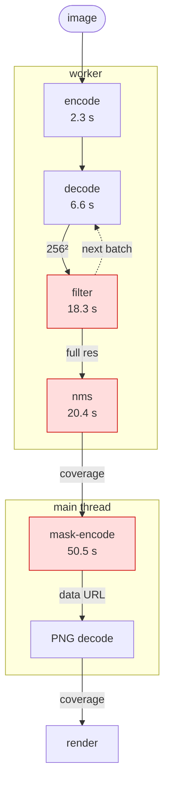
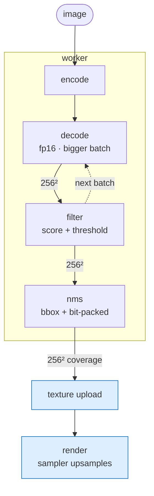
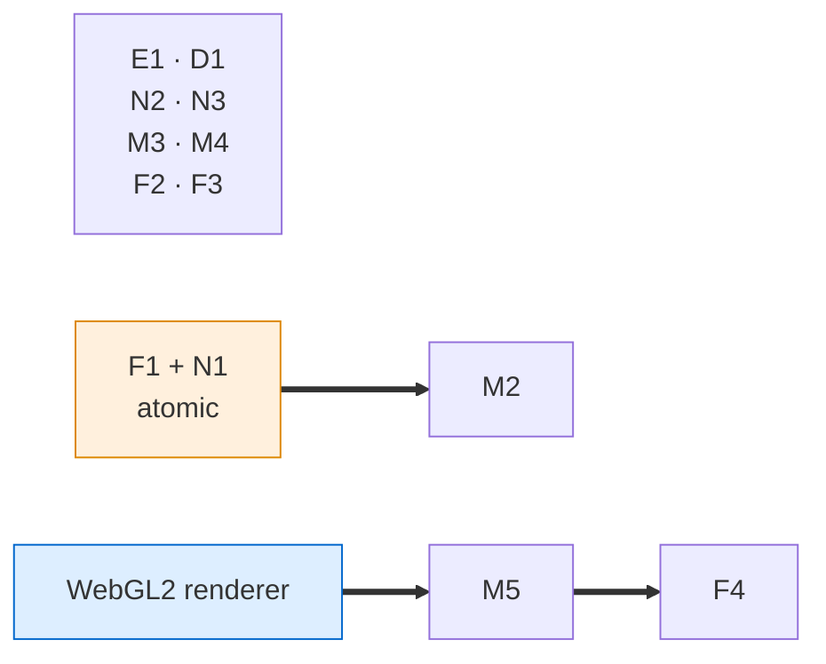

# Segmenter pipeline — before and after

How everything-mode segmentation runs today, what each stage does, and what the
optimized pipeline looks like. Source:
[issue #1](https://github.com/BoTime/NoteScanner/issues/1), which carries the
full measurements and the reasoning behind every change referenced here.

The pipeline runs entirely in the browser: SlimSAM-77 on WebGPU inside a Web
Worker, prompted on a grid of points, producing one mask per post-it note.

Two measured operating points are used throughout — same code, different grid
density:

| | `pointsPerSide` | grid points | decoder batches | per-image budget |
|---|---:|---:|---:|---:|
| **Run A** | 16 (default) | 256 | 32 | **98.4 s** |
| **Run B** | 32 | 1,024 | 128 | **166.4 s** |

`model-load` is excluded from every budget: it is a one-time session cost
(4.8 s cold, 0.7 s warm), not a per-image one.

---

## 1. The pipeline before

Timings are Run A. The red stages are **90.7% of the budget** in Run A, 86.0% in
Run B.

### What each stage does

**`encode` — image embeddings, once per image.** Draws the `ImageBitmap` to an
`OffscreenCanvas`, runs the SAM processor, then the ViT image encoder. The
embeddings are computed once and reused by every grid point, which is the whole
reason everything-mode is viable. This stage is already correctly designed and is
the only one that does not grow with grid density. 2.4% of Run A.

**`decode` — one mask-decoder pass per batch of prompt points.** A grid of
`pointsPerSide²` points is built and split into batches of `batchSize`. Each
batch is prompted against the cached embeddings, returning
`pred_masks [1, batch, 3, 256, 256]` plus IoU scores — three candidate masks per
point, at **256×256**, the model's native mask resolution. This is irreducible
model work and defines the floor of the budget.

**`filter` — pick the best mask per point, then upsample it.** Three sub-steps:

1. `stabilityScore` + IoU score, best 1 of 3 per point — at 256×256, genuinely
   cheap (~2-3% of the stage).
2. `post_process_masks` — bilinear 256×256 → 1024×1024, slice to the padded
   region, bilinear again to the original image size. **~75-85% of the stage.**
   Both interpolations run as one-op ONNX graphs on the **WASM/CPU** execution
   provider — transformers.js has `executionProviders: ['webgpu']` commented out
   upstream — so the largest CPU cost in the worker runs on the CPU while an
   initialised WebGPU device sits idle.
3. `thresholdMask` + `minMaskArea` — at full resolution, so tiny masks are
   upsampled and *then* discarded.

Because this runs *before* NMS, it upsamples every candidate. Run B measured
**617 masks upsampled to keep 35** — 94% of the work is discarded.

**`nms` — deduplicate overlapping masks.** `dedupeMasks` is greedy
largest-area-first: each candidate is tested against every already-kept mask via
a byte-wise IoU loop over **full-resolution** coverage arrays. Cost is
*candidates × kept*, and both terms rise with grid density. It is the only
superlinear stage: 4× the prompt points grew the whole budget 1.69× but grew
`nms` **3.63×**, taking it from 20.7% of Run A to **44.5% of Run B**, the largest
single stage there. Run B's ~15.1 billion byte-pair operations are what 74 s
buys.

**`mask-encode` — turn each kept mask into a PNG data URL.** A serial `await`
loop on the **main thread**, so it is also ~50 s of UI jank. Per mask: expand
1 byte/px coverage to 4 bytes/px RGBA, `putImageData`, PNG DEFLATE,
`blob.arrayBuffer()`, chunked base64. Its p50 is **1,069 ms per mask in both
runs**, identical to within 0.7 ms — conclusive that the cost is strictly
per-mask and driven by full resolution.

**The viewer round trip — and the whole point.** `SegmentViewer` takes the data
URL, decodes the PNG, `drawImage`s it, `getImageData`s it back, and thresholds it
into a `Uint8Array` **byte-identical to the one the worker already transferred
zero-copy**. The mask image is never painted; the `Renderer` interface takes
coverage arrays, not images. The entire encode/decode round trip reconstructs its
own input.

### The one root cause

`filter`, `nms` and `mask-encode` are the same mistake three times:
**full-resolution data standing in for a 256×256, 1-bit signal.** The decoder
emits 256×256 logits; everything downstream pays full-resolution cost for an
interpolation that adds no information, and then pays 32 bits per pixel to carry
1 bit of it.

| Stage | Run A | | Run B | |
|---|---:|---:|---:|---:|
| `encode` | 2.3 s | 2.4% | 1.2 s | 0.7% |
| `decode` | 6.6 s | 6.8% | 22.0 s | 13.2% |
| `filter` | 18.3 s | 18.6% | 31.7 s | 19.0% |
| `nms` | 20.4 s | 20.7% | **74.1 s** | **44.5%** |
| `mask-encode` | **50.5 s** | **51.3%** | 37.4 s | 22.5% |
| overhead | 0.2 s | 0.2% | 0.04 s | 0.0% |
| **total** | **98.4 s** | | **166.4 s** | |
| *model inference share* | *9%* | | *14%* | |

---

## 2. The proposed pipeline

Two costs are gone rather than reduced: **`mask-encode` no longer exists**, and
**the CPU upsample no longer exists**. Nothing in the pipeline materialises a
full-resolution mask.

### What changes, stage by stage

**`encode` — unchanged in shape.** fp16 weights (**E1**) instead of fp32 make the
ViT encoder ~1.5-2× faster. Optionally cache embeddings across runs (**E2**) so
re-running with different thresholds does not re-encode the same image.

**`decode` — unchanged in shape, larger batches.** `batchSize` 8 pays fixed ORT
dispatch overhead 32× in Run A and 128× in Run B; raising it to 32 (**D1**)
removes part of that, and is now the default. Measured, the effect is smaller
than this section originally claimed and does not extend upward: **64 is
unusable**, dying with `Array buffer allocation failed`, and 32 is bounded above
by memory rather than by diminishing returns
(`docs/measurements/2026-08-28-decode-sweep.md`, and issue #12). fp16 helps here
too, but it also changes the kept-mask count in both directions, so it stays a
product decision rather than a default. This stage stays the floor, and that is
the intended end state: model inference should be the bottleneck.

**`filter` — stops upsampling.** The candidate mask stays at 256×256 throughout.
Score-and-select and the threshold/area test run at low resolution (**F3**), and
the upsample is deferred past NMS (**F1**) so only survivors would ever pay for
it — 617 → 35 in Run B. Under a GPU renderer it is deferred to never: the texture
sampler performs the upsample in hardware (**F4**). If a CPU upsample is kept for
any path, it goes 256×256 → original in a single resample (**F2**) rather than
via a 1024×1024 intermediate.

**`nms` — cheap and density-independent.** Three compounding changes: run IoU at
**256×256** (**N1**, statistically near-identical to full res, because that *is*
the source resolution); skip the pixel loop entirely for pairs whose bounding
boxes cannot overlap (**N2**); and bit-pack coverage into a `Uint32Array` so
intersection is `a & b` plus a popcount — 32 pixels per operation (**N3**).
Together: ~20.4 s → ~0.3 s (A), ~74.1 s → ~0.3 s (B). The post-fix cost barely
moves with grid density, which is the point — `nms` is what prices you out of a
denser grid.

**`mask-encode` — deleted.** Under a GPU renderer the worker's coverage array is
uploaded straight to an `R8` texture (**M5**): no RGBA expansion, no PNG, no data
URL, no image decode. Until that lands, the same bytes are encoded as a **1-bit
indexed PNG** with a 2-entry palette and a `tRNS` chunk (**M3**) — ~32× smaller,
natively ``-decodable, so the `maskUrl: string` contract is untouched — and
encoded **inside the worker** (**M4**) so it never blocks the UI.
Encoding at the decoder's own window (**M2**) shrinks it again: the PNG is
written at
`min(round(lowWidth × reshapedWidth / padWidth), originalWidth)` ×
`min(round(lowHeight × reshapedHeight / padHeight), originalHeight)` — 256×162
on the 1024×649 sample, ~16× fewer pixels than full resolution rather than the
~10× first estimated here — and `SegmentViewer` upscales it back to image space
nearest-neighbour (`imageSmoothingEnabled = false`), which keeps every
read-back pixel exactly `(255,255,255,255)` or `(0,0,0,0)`. In the prototype
only, **M1** deletes the round trip outright by handing coverage arrays to
`SegmentViewer` directly.

**The renderer — the structural change.** `renderer/types.ts` already takes
`Map<string, { coverage, area }>`, never an image, behind a pluggable
`RendererFactory` with a conformance suite. A **WebGL2** renderer (not WebGPU —
WebGL2 is enough, and `canvas2d` stays the fallback) gets both M5 and F4:
`texImage2D` from the transferred `Uint8Array`, and `LINEAR` filtering on `R8` as
the upsample. Two things to decide alongside it: hit-testing still needs
CPU-side coverage (keep a 256×256 array and scale click coordinates, or do exact
GPU picking), and the `Renderer` interface grows to take low-res coverage plus
target dimensions.

### Where the budget lands

| Stage | Run A before | Run A after | Run B before | Run B after |
|---|---:|---:|---:|---:|
| `encode` + `decode` | 9.0 s | ~5.4 s | 23.2 s | ~13.9 s |
| `filter` | 18.3 s | ~0.7 s | 31.7 s | ~2.0 s |
| `nms` | 20.4 s | ~0.3 s | 74.1 s | ~0.3 s |
| `mask-encode` | 50.5 s | **0** | 37.4 s | **0** |
| overhead | 0.2 s | 0.2 s | 0.04 s | 0.04 s |
| **total** | **98.4 s** | **~6.6 s** | **166.4 s** | **~16.2 s** |
| *model inference share* | *9%* | *82%* | *14%* | *86%* |

~15× (A) and ~10× (B), with model inference correctly the bottleneck. Getting
most of the way there does not require the renderer: **CPU-only changes alone are
~8× (A) / ~6× (B)** and ship against today's `maskUrl` contract.

### What ships today

Waves 1 and 2 have landed, so this section is no longer a proposal for them:

- `filter` scores and thresholds at 256×256 and retains a copy of each chosen
  candidate's logit window; no full-resolution buffer is allocated in the batch
  loop (**F1**, **F3**, behind `lowResFilterNms`, default on).
- `nms` runs on 256×256 coverage with a bbox prefilter and bit-packed popcounts
  (**N1**, **N2**, **N3**).
- Only NMS survivors are resampled, in a single pass straight from the logits,
  and the exact, unscaled `minMaskArea` is re-applied there — the gap between
  the `afterNms` and `returned` counts.
- `mask-encode` writes a 1-bit indexed PNG inside the worker (**M3**, **M4**)
  from a SECOND resample of the same logits at the encode target above
  (**M2**, behind `lowResMaskEncode`, default on). That second resample is
  timed into `resample`, not into `mask-encode`.
- The viewer still decodes the PNG back into an image-space coverage array;
  **M1**/**M5** and the WebGL2 renderer (**F4**) remain future work.

---

## 3. Change catalogue

| ID | Change | Stage | Needs |
|---|---|---|---|
| E1 | fp16 weights | encode + decode | — |
| E2 | cache embeddings across runs | encode | — |
| D1 | raise `batchSize` above 8 | decode | — |
| F1 | defer the upsample past NMS | filter | atomic with N1 |
| F2 | single-pass 256² → original resample | filter | — |
| F3 | threshold + area at 256² | filter | — |
| F4 | never upsample on CPU; the sampler does it | filter | renderer |
| F5 | WebGPU for `interpolate_4d` | filter | upstream-blocked |
| N1 | run IoU at 256² | nms | atomic with F1 |
| N2 | bounding-box prefilter | nms | — |
| N3 | bit-packed coverage + popcount | nms | — |
| N4 | area-ratio early exit | nms | — |
| N5 | GPU compute-shader IoU matrix | nms | WebGPU; not recommended |
| M1 | pass coverage arrays directly (prototype) | mask-encode | — |
| M2 | encode at 256² | mask-encode | F1 + N1 |
| M3 | 1-bit indexed PNG + `tRNS` | mask-encode | — |
| M4 | encode off the main thread | mask-encode | — |
| M5 | coverage straight to a GPU texture | mask-encode | renderer |

Only three hard dependency edges exist in the whole plan: **F1 ⇔ N1 is one
atomic change** (the upsample can only be deferred if NMS runs at 256×256, and
NMS can only run at 256×256 if the upsample is deferred), **M2 needs F1 + N1**,
and **M5 + F4 need the renderer**. Everything else can start in any order.

---

## 4. Sequencing and status

The plan is tracked as eight issues, numbered in implementation order.

| Issue | Wave | Changes | Status |
|---|:---:|---|---|
| [#2](https://github.com/BoTime/NoteScanner/issues/2) | 0 | sub-timers inside `filter` | landed |
| [#3](https://github.com/BoTime/NoteScanner/issues/3) | 1 | E1 + D1 — fp16, larger `batchSize` | measured; adoption tracked in [#12](https://github.com/BoTime/NoteScanner/issues/12) |
| [#4](https://github.com/BoTime/NoteScanner/issues/4) | 1 | N2 + N3 — bbox prefilter, bit-packed NMS | landed |
| [#5](https://github.com/BoTime/NoteScanner/issues/5) | 1 | M3 + M4 — 1-bit PNG, in the worker | landed |
| [#6](https://github.com/BoTime/NoteScanner/issues/6) | 2 | F1 + N1 + F3 — carry 256² through | landed |
| [#7](https://github.com/BoTime/NoteScanner/issues/7) | 2 | M2 — encode at 256² | landed |
| [#8](https://github.com/BoTime/NoteScanner/issues/8) | 3 | F2 — single-pass resample | open |
| [#9](https://github.com/BoTime/NoteScanner/issues/9) | 4 | M5 + F4 — WebGL2 renderer | open |

Sequenced budgets — each wave measured on what the previous one left behind:

| | Run A | Run B |
|---|---:|---:|
| today | 98.4 s | 166.4 s |
| after wave 1 | ~26.7 s · ~3.7× | ~51.2 s · ~3.2× |
| after wave 2 | ~10.1 s · ~9.7× | ~21.2 s · ~7.8× |
| after wave 3 | ~8.2 s · ~12× | ~17.9 s · ~9.3× |
| after wave 4 | ~6.6 s · ~15× | ~16.2 s · ~10.3× |

**If the WebGL2 renderer is committed up front**, skip M2, M3, M4 and F2 — M5
deletes the encode path and F4 deletes the upsample — and use M1 in wave 1
instead. Still do F1 + N1 (a worker-side change the renderer cannot do for you),
and still do E1, D1, N2, N3. Same end state, materially less code written and
then discarded. M3 keeps independent production value regardless: 32× smaller
masks on R2.

## 5. Caveats

- Stage totals are measured; the projected budgets are not — they reuse
  per-optimization factors derived from the code structure. The `filter`
  internal split was the weakest of them, which is what issue #2's sub-timers
  address.
- F1 is costed throughout at ÷4.6 (Run A's ~250 → 54). Run B measures ÷17.6
  (617 → 35), so every F1 figure here is deliberately conservative.
- `~0.7 MB` per coverage array is Run A's figure carried into Run B. Every
  full-resolution term scales with it — a 12 MP phone photo makes them ~17×
  worse than modelled.
- The two runs differ in more than grid density: different source image,
  `nmsIouThreshold` 0.9 vs the 0.7 default, warm vs cold model cache. They are
  two data points, not a controlled sweep. What they establish well is per-unit
  cost; what they establish only loosely is the exact scaling exponent of `nms`.
